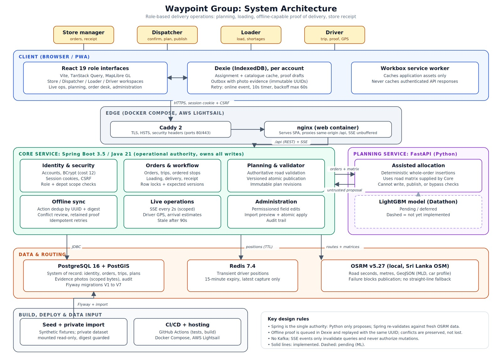

# Waypoint Group

**Retail distribution operations, from order planning to confirmed store receipt.**

[](https://github.com/Geemal2004/geemalmuthugala-Waypoint/actions/workflows/ci.yml)


[Competition demo](https://18-138-29-235.sslip.io) · [Architecture](docs/architecture.md) · [Capabilities](docs/product-capabilities.md) · [Verification](docs/verification.md)

Waypoint connects store managers, dispatchers, loaders, and drivers in one authenticated workflow for Fresh, Style, and Tech deliveries. It supports road-based multi-stop planning, versioned publication, approved loading shortages, offline delivery evidence, and separate store receipt confirmation.

Spring owns and validates every operational write. Python proposes deterministic whole-order allocations; Spring checks them again against current road routes and business constraints before publication.

## Contents

- [Role workspaces](#role-workspaces)
- [System architecture](#system-architecture)
- [Quick start](#quick-start)
- [Repository structure](#repository-structure)
- [Offline delivery and recovery](#offline-delivery-and-recovery)
- [Private data and road routing](#private-data-and-road-routing)
- [Development and testing](#development-and-testing)
- [Deployment](#deployment)
- [Documentation](#documentation)
- [Current boundaries](#current-boundaries)

## Role workspaces

| Role | Responsibilities |
| --- | --- |
| **Store manager** | Create and resume orders, submit demand, track deliveries, and confirm actual received quantities. |
| **Dispatcher** | Confirm demand, propose or edit plans, validate and publish revisions, approve shortages, and review proof conflicts. |
| **Loader** | Follow reverse delivery order, count physical quantities, record shortages, and release every stop before departure. |
| **Driver** | Acknowledge the released trip, follow ordered stops, confirm arrival while parked, capture proof, and monitor sync. |

Account and depot scopes are enforced on the server. Administration additionally requires an explicit permission. Select the same **Operating day** across roles when demonstrating a shared trip. Location sharing requires explicit consent and browser permission.

## System architecture



| Layer | Technology | Purpose |
| --- | --- | --- |
| Browser / PWA | React 19, TypeScript, Vite, Tailwind, TanStack Query, MapLibre GL | Role workspaces, maps, planning, and live operations |
| Local storage | Dexie / IndexedDB, Workbox | Account-scoped cache, proof drafts and outbox; application asset caching |
| Core API | Spring Boot 3.5, Java 21 | Identity, authorization, workflow, validation, publication, audit, and reconciliation |
| Planning API | FastAPI, Python 3.12 | Deterministic whole-order insertion; returns proposals to Core |
| Persistent data | PostgreSQL 16 + PostGIS, Flyway | Orders, plans, trips, evidence, identities, and audit history |
| Transient positions | Redis 7.4 | Latest driver positions with a 15-minute expiry |
| Road routing | OSRM 5.27, prepared Sri Lanka OSM graph | Road durations, distances, matrices, and route geometry |
| Edge / hosting | nginx, Caddy 2, Docker Compose, AWS Lightsail | Same-origin API proxy, unbuffered SSE, and HTTPS hosting |

Session cookies and CSRF protect authenticated requests. Scoped server-sent events refresh operational queries. Expected versions and database locks protect concurrent edits; immutable action UUIDs and payload digests make proof retries idempotent. Workbox **never caches authenticated API responses**.

See [architecture details](docs/architecture.md) and [the data model](docs/data-model.md). Dashed elements in the diagram represent pending ML work.

## Quick start

Install **Docker Desktop with Compose v2**, then run from the repository root:

```powershell
Copy-Item .env.example .env
docker compose up --build
```

| Endpoint | Address |
| --- | --- |
| Application | [localhost:8080](http://localhost:8080) |
| Core readiness | [localhost:8081/actuator/health/readiness](http://localhost:8081/actuator/health/readiness) |
| Planning health | [localhost:8000/health](http://localhost:8000/health) |
| Planning API docs | [localhost:8000/docs](http://localhost:8000/docs) |

The default stack starts PostgreSQL/PostGIS, Redis, Planning, Core, and Web. Flyway applies migrations. With `DEMO_SEED=true`, startup creates four synthetic judge accounts and six scenario orders. Database data persists in a Docker volume. Stop with `Ctrl+C`; `docker compose down` removes containers while preserving that volume.

### Local demo accounts

| Role | Username | Local password |
| --- | --- | --- |
| Store manager | `manager` | `WaypointDemo!2026` |
| Dispatcher | `dispatcher` | `WaypointDemo!2026` |
| Loader | `loader` | `WaypointDemo!2026` |
| Driver | `driver` | `WaypointDemo!2026` |

Demo seeding also enables a one-click role picker for seeded judge accounts. Production disables it with `DEMO_SEED=false`. Competition credentials are managed privately; these passwords apply only to local development.

### Configuration

[`.env.example`](.env.example) lists database credentials, loopback ports, demo seeding, session security, and planning policies. Keep `SESSION_SECURE=false` for local HTTP; HTTPS deployments require secure cookies.

**Road-based planning requires a separately prepared OSRM graph.** Without it, proposals report routing unavailable. The default stack does not prepare private inputs or road routing.

## Repository structure

```text
Waypoint-Group/
├── apps/web/                  # React PWA and Playwright tests
│   ├── src/components/        # Store, planning, operations, maps, administration
│   ├── src/lib/               # API, connectivity, storage, proof sync, GPS
│   └── tests/                 # Delivery, driver, responsive browser coverage
├── services/
│   ├── core/                 # Spring Boot API, Flyway migrations, Java tests
│   └── planning/             # FastAPI allocation service and Python tests
├── deploy/                   # HTTPS and Lightsail configuration
├── docs/                     # Architecture, policies, verification, demo guides
│   └── assets/               # Documentation images
├── seed/                     # Four-persona campaign fixtures and instructions
├── tools/                    # Imports, routing, walkthroughs, backups
├── data/                     # Local/private inputs and prepared routing data
├── .github/workflows/ci.yml   # Checks and competition deployment
├── compose.yaml              # Local stack; optional routing profile
├── compose.production.yaml   # Production overlay
├── compose.lightsail.yaml    # Competition hosting overlay
└── compose.video.yaml        # Isolated video demo overlay
```

Private datasets, credentials, derived imports, browser profiles, and generated evidence stay outside version control. Temporary browser reports are written under ignored `tmp/`.

## Offline delivery and recovery

At an **arrived stop**, the driver can retain quantities, an issue reason, and a JPEG/PNG locally, then explicitly save proof to an immutable outbox. The photo and action are stored atomically before upload. Evidence survives offline reloads and remains account scoped.

The driver indicator reflects API reachability. Connection failures, request timeouts, and server errors switch it to **Offline**, even when Wi-Fi remains connected. Saved assignments remain available and proof capture continues; online departure and arrival handoffs stay disabled. Successful service responses restore the online state.

Sync retries on reconnection, app opening, a foreground timer, and manual retry, with backoff capped at 60 seconds. If a stop changed before upload, the server retains the evidence for dispatcher review. Local save, server acceptance, and store receipt are distinct states.

Browser storage is not a backup, and background tracking is not guaranteed. See [architecture](docs/architecture.md) and [verification](docs/verification.md) for recovery details.

## Private data and road routing

The source-data walkthrough requires supplied private challenge files and a prepared OSRM graph:

```powershell
./tools/prepare-data.ps1 -SourceDirectory 'C:\private\challenge\data'
./tools/prepare-routing.ps1
docker compose --profile routing up -d osrm
./tools/prepare-planning-data.ps1 -SourceDirectory 'C:\private\challenge\data'
docker compose --profile routing up --build -d --wait
```

The import retains the seven General Data files and 85 Task 2B S1 orders with source identifiers. The files do not provide outlet coordinates, SKU breakdowns, or certified cold ranges. Labelled supplemental road waypoints and cold capabilities support the judge demonstration; aggregate source demand is not an invented SKU catalogue.

The undated S1 scenario uses **8 January 2026** as its replay planning date. Trip schedules use **Asia/Colombo**; capture and audit timestamps remain the actual demonstration time.

OSRM failure blocks road-dependent proposals and publication. There is no straight-line fallback. See [dataset audit](docs/dataset-audit.md), [constraints and policies](docs/constraints-and-policies.md), and [API walkthrough](docs/api-walkthrough.md).

For the supplemental recording campaign, select **12 October 2026** and follow [the video seed guide](seed/README.md), [scene plan](docs/demo-seed-plan.md), and [recording script](docs/demo-video-script.md). Reset procedures belong to disposable demo environments; the guides document their scope.

## Development and testing

Use **Node.js 22**, **Java 21 with Maven**, and **Python 3.12**. Docker is required for integration tests and the full stack.

### Frontend

```powershell
cd apps/web
npm ci
npm run dev
```

Vite proxies `/api` to Core on port `8081`. Run checks and browser tests:

```powershell
npm run typecheck
npm run build
npx playwright install chromium
npm run test:e2e
```

Browser tests expect a running app at `http://localhost:8080`; set `WAYPOINT_URL` for another endpoint. Source scenarios require prepared private inputs and fresh demo state. Standalone driver UI tests mock API responses and use the production PWA shell.

### Core

From `services/core`:

```powershell
mvn verify -Pintegration
```

Integration tests use disposable Testcontainers PostgreSQL.

### Planning

From `services/planning`, in a Python virtual environment:

```powershell
python -m pip install -r requirements.txt
python -m pytest
```

With the stack running, execute `node tools/online-walkthrough.mjs` from the repository root for authenticated API handoffs and replay recovery. Dataset and location walkthroughs require their documented fixtures.

[GitHub Actions](https://github.com/Geemal2004/geemalmuthugala-Waypoint/actions) checks frontend builds, Java tests, Python tests, API handoffs, and browser scenarios. See [CI/CD](docs/ci-cd.md) and [verification evidence](docs/verification.md) for scope and recorded results.

## Deployment

The competition environment uses Docker Compose on **AWS Lightsail**, with Caddy HTTPS, persistent database/certificate volumes, and prepared host-side routing data. Successful checks on `main` trigger competition deployment when the required environment secrets are configured.

- [AWS deployment and recovery](docs/aws-deployment.md): competition configuration, release updates, and recovery.
- [Production deployment](docs/deployment.md): secure sessions, disabled demo features, administrator provisioning, backups, and restore.
- [CI/CD](docs/ci-cd.md): workflow jobs, deployment environment, and required secrets.

Private datasets and SSH keys remain outside Git. Production acceptance and physical-device validation are separate from competition hosting.

## Documentation

| Guide | Coverage |
| --- | --- |
| [Product capabilities](docs/product-capabilities.md) | Implemented workflows and pending features |
| [Architecture](docs/architecture.md) / [Data model](docs/data-model.md) | Services, trust boundaries, storage, concurrency |
| [Constraints and policies](docs/constraints-and-policies.md) | Capacity, access, timing, cold requirements, publication |
| [Dataset audit](docs/dataset-audit.md) | Source provenance and supplemental assumptions |
| [API walkthrough](docs/api-walkthrough.md) / [Verification](docs/verification.md) | Reproducible checks and acceptance evidence |
| [Development priorities](docs/development-priorities.md) | Remaining engineering work |
| [Design departures](docs/design-departures.md) / [Figma coverage](docs/figma-screen-coverage.md) | Design fidelity and implementation rationale |
| [AI disclosure](docs/ai-disclosure.md) / [Submission guide](docs/submission-guide.md) | Tool use and competition submission |

[Design reference in Figma](https://www.figma.com/design/gWapWGfw3V1dhKLlMKSwxG/Waypoint_Designathon--Copy-?node-id=2303-146).

## Current boundaries

- Allocation uses deterministic feasible insertion and does not claim optimality. LightGBM integration remains deferred to the Datathon; Kafka is absent.
- Explicit linked rescheduling is supported. Automatic rolling rescheduling, ranked mall recovery, and published membership/vehicle reassignment remain restricted or pending.
- OSRM uses its car profile without live traffic or certified truck restrictions. Supplemental waypoints and cold ranges are labelled demo assumptions.
- Physical GPS, camera behavior, background execution, and production acceptance require deployment validation. Receipt-specific damage attachments and signatures remain pending.

See [product capabilities](docs/product-capabilities.md) and [verification](docs/verification.md) for detailed status.
