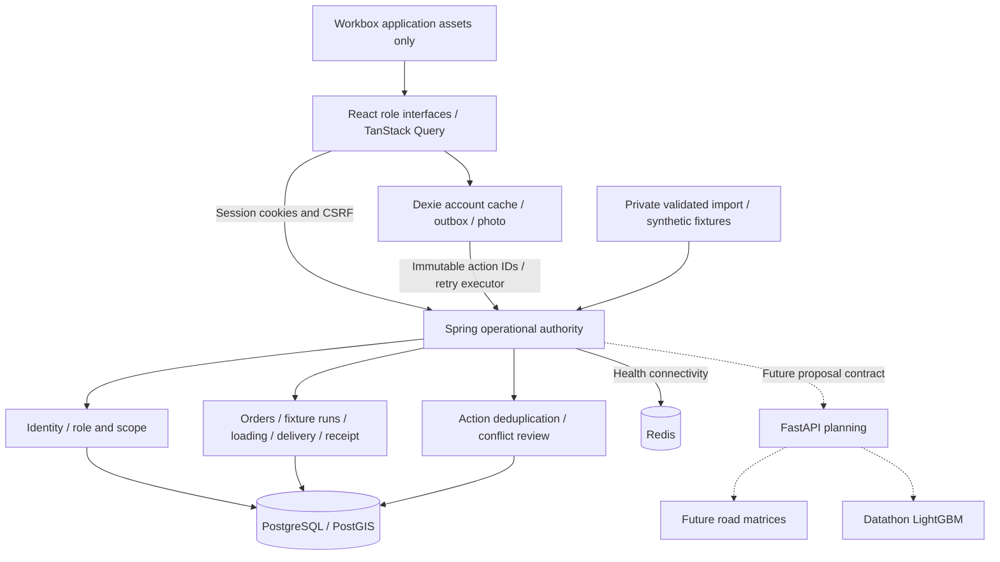

# Architecture

Solid lines are implemented; dotted lines are pending. Spring owns mutations, identities, assignment scopes and audit. Order row locks plus expected versions reject stale edits; vehicle locks serialize fuel/trip reservations. Global action locks and a digest make proof retries idempotent. Accepted proof/action commit together; conflicts preserve the delivery payload and photo without claiming completion. Resolution retains deferral history and original action outcomes.

Passwords use BCrypt cost 12. Sessions use HttpOnly/SameSite cookies and session-backed CSRF, including login. nginx proxies same-origin /api; Vite uses a development proxy. Evidence stays in scoped PostgreSQL byte storage with no-store retrieval and no filesystem paths.

Workbox caches application assets, never authenticated API responses. Dexie caches explicit per-account assignments/catalog and stores outbox actions with evidence atomically. Connectivity events, app opening, a 10-second foreground timer and manual retry trigger sync; exponential backoff is capped at 60 seconds. In-flight interrupted actions replay with the same UUID. Device capture and server acceptance times remain distinct. Conflict resolution is polled through an account-scoped action endpoint. Logout clears the active identity/query cache while retaining account-scoped evidence; another account cannot read it through the app. Device storage can be cleared by the browser/OS; it is not a backup.

Python exposes health and explicit unavailable allocation. OR-Tools/LightGBM are dependencies, without a trained model or solver result. Redis is health-checked, without live location ingestion. Kafka is absent. Source routing and verified travel/time constraints are prerequisites for source-network publication.

Compose starts with migrations and synthetic fixtures. The optional read-only private import is atomic and digest guarded. DB/Redis/OSRM have no host bindings; web/core/planning bind loopback. Public HTTPS deployment remains a submission action.
