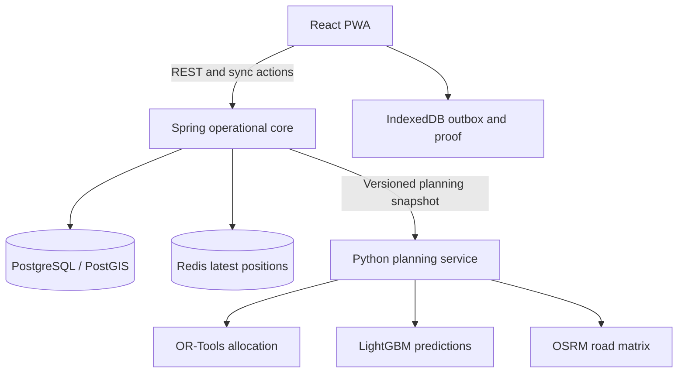

# Architecture

Current integration: web → core → database reference data. All remaining arrows are target architecture, not implemented behaviour.

Spring owns workflow state and validates both manual edits and solver proposals. Python does not write operational tables. Planning jobs will carry input versions and stale proposals will not publish. PostgreSQL transactions will persist accepted offline actions and idempotency records together. Redis is never authoritative for proof or receipt records.

Start with one modular Spring application: identity, network, orders, planning, loading, delivery and receipt modules. Optimisation and ML share one Python deployment but separate modules. Kafka is not part of the initial stack.
