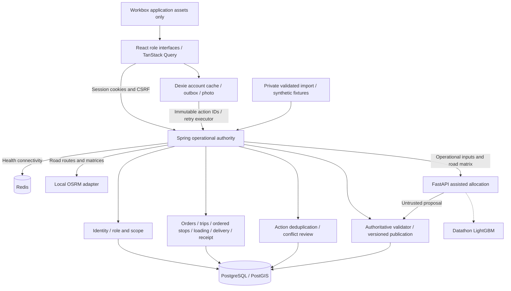

# Architecture

Solid lines are implemented; dotted lines are pending. Spring owns mutations, identities, assignment scopes and audit. Order row locks plus expected versions reject stale edits; vehicle locks serialize fuel/trip reservations. Global action locks and a digest make proof retries idempotent. Accepted proof/action commit together; conflicts preserve the delivery payload and photo without claiming completion. Resolution retains deferral history and original action outcomes.

Passwords use BCrypt cost 12. Sessions use HttpOnly/SameSite cookies and session-backed CSRF, including login. nginx proxies same-origin /api; Vite uses a development proxy. Evidence stays in scoped PostgreSQL byte storage with no-store retrieval and no filesystem paths.

Workbox caches application assets, never authenticated API responses. Dexie caches explicit per-account assignments/catalog and stores outbox actions with evidence atomically. Connectivity events, app opening, a 10-second foreground timer and manual retry trigger sync; exponential backoff is capped at 60 seconds. In-flight interrupted actions replay with the same UUID. Device capture and server acceptance times remain distinct. Conflict resolution is polled through an account-scoped action endpoint. Logout clears the active identity/query cache while retaining account-scoped evidence; another account cannot read it through the app. Device storage can be cleared by the browser/OS; it is not a backup.

Python proposes deterministic whole-order insertions using Spring's OSRM matrix. It cannot write orders, publish plans or bypass Spring's fresh road calculation and constraints. Publication locks the depot/day revision, vehicles, existing manifests and orders; checks plan/order versions; and writes revision, trips, ordered stops, runs and deferrals atomically. Database uniqueness prevents double assignment. Immutable revisions retain request, road geometry and schedules. Reordering preserves run/stop/order IDs and is limited to untouched scheduled manifests.

OSRM errors block publication. The adapter requires road seconds/metres and GeoJSON, rejects unreachable/null/fallback cells and large snaps, and never substitutes straight-line metrics. Weekly fuel counts each parent trip once. Road travel/wait/service/return is separate from the booklet's outbound/inter-stop/service budget. ML and live location ingestion remain deferred; Kafka is absent.

Compose starts with migrations and legacy fixtures. Private network/S1 imports are read-only mounts and stay out of images. The network import is digest guarded; idempotent S1 seeding restores missing judge orders after an explicit reset. OSRM uses the routing profile and a loopback debugging port; web/core/planning also bind loopback. DB/Redis remain internal. Public HTTPS deployment remains a submission action.
