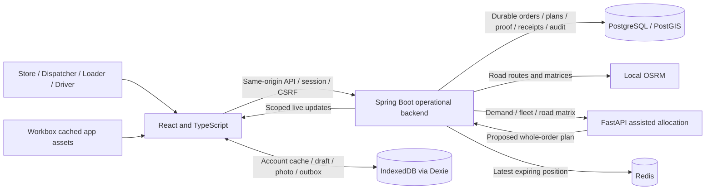

# Waypoint: architecture, code explanation, then four-persona demo

Recording target: approximately **8 minutes**, with short cuts for repeated loading steps and network reconnection. Record a longer continuous take if needed, then edit to this sequence. Read only the **Say** paragraphs; **Show**, **Do** and **Check** are presenter directions.

This script uses the merged local video campaign at **http://localhost:8080**, operating day **12 October 2026**, Asia/Colombo. The campaign has 37 orders, six drafts, five active-day trips and nine completed historical receipts. It is supplemental retail demo data. The 85 January S1 source orders remain a separate replay.

## Preparation before recording

1. Keep the four independent Store manager, Dispatcher, Loader and Driver windows open. Check October 12 in every window. The manager starts at **Demo Fresh · Kelaniya**. Keep the desktop browser at a readable zoom and use the prepared phone layout for driver clips.
2. Have a JPEG/PNG photograph of your own sample packaging ready, up to 5 MB. The seed's illustrated packaging image is explicitly staged evidence; do not describe it as a real customer delivery photograph.
3. Arrange source tabs for the architecture/code section: `compose.yaml`, `App.tsx`, `PlanningService.java`, `allocation.py`, `WorkflowRules.java`, `sync.ts` and `SyncService.java`. Use the code map below to find them. Show focused functions, rather than scrolling through entire files.
4. Keep this script and the cue sheet below beside the recording. After a campaign reset, WP references change; use the latest `data/private/video-demo-local/report.json` to refresh the cue sheet.
5. Do not reset the database during a recording. Server data restoration and browser evidence are separate. Keep rehearsal evidence in its own disposable browser contexts.
6. For the offline scene, use **DevTools → Network → Offline in the Driver window only**. Keep Dispatcher and Store manager online. Enable application caching by visiting/reloading the arrived proof screen online first. Do not disconnect the entire computer or stop the backend.

### Current recording cue sheet

| Scene | Campaign key | Current WP reference | Outlet / quantities |
| --- | --- | --- | --- |
| Pending order review fallback | A01 | WP-002460 | Fresh Kelaniya, 12 rice cartons |
| Assisted proposal | A04 | WP-002463 | Fresh North, 8 rice cartons; 160 kg / 0.32 m³ |
| Van volume failure | A08 | WP-002467 | Style North, 25 garments; 200 kg / 3.75 m³ |
| Main trip, delivery stop 1 / loading position 3 | A09 | **WP-002468** | Fresh Kelaniya, 10 rice ordered; record 9 loaded |
| Main trip, delivery stop 2 / loading position 2 | A10 | **WP-002469** | Fresh North, 8 rice cartons |
| Main trip, delivery stop 3 / loading position 1 | A11 | **WP-002470** | Fresh East, 6 rice cartons |
| Style scheduled trip | A12–A14 | WP-002471–WP-002473 | Mall first, then two rear receiving docks |
| Existing Tech loading hold | A15 | WP-002474 | Two TVs ordered, one physically counted, approval pending |
| Chilled trip | A18–A20 | WP-002477–WP-002479 | 8 / 6 / 10 milk crates; 2–5°C load |
| Already-arrived offline fallback | A22 | WP-002481 | Fresh East, 6 rice; separate journey truck |
| Existing receipt tasks | A23–A24 | WP-002482–WP-002483 | Fresh Kelaniya / North, 4 / 5 rice |
| Excess demand deferral | A25 | WP-002484 | Fresh South, 1,000 rice; 20,000 kg / 40 m³ |
| Tech closure / linked replacement | A26 / N01 | WP-002485 / WP-002496 | One TV; original October 12, replacement October 13 |
| Historical approved shortage | H02 | WP-002488 | Five rice ordered; four loaded, delivered and received |
| Historical receiving damage | H09 | WP-002495 | Two TVs delivered; one accepted at receiving, separate issue |

The main handoff is the **VIDEO-MAIN-DRY** trip containing WP-002468, WP-002469 and WP-002470. Do not accidentally choose the already-started **VIDEO-DRY-2** trip. Its arrived WP-002481 is reserved as an optional shorter offline scene.

## Part 1 — architecture and code

### 0:00–0:25 — Introduce the problem

**Show:** Waypoint logo and the four persona windows, followed by the architecture diagram.

**Say:**

“Waypoint connects store managers, dispatchers, loaders and drivers through one delivery workflow. It turns store demand into validated vehicle trips, records what was physically loaded, preserves driver evidence when connectivity drops, and asks the store to confirm what it actually received. I’ll first explain how the code supports that workflow, then demonstrate the four roles.”

### 0:25–1:05 — Explain the system components

**Show:** Diagram below, then briefly show the services in `compose.yaml`. The diagram is a logical view: Docker nginx normally serves the frontend; our local video preview provides the same-origin frontend/API proxy while Docker Desktop's Windows proxy is stalled.

**Say:**

“The frontend is React and TypeScript. TanStack Query manages server data, while Dexie stores account-scoped assignments, photo drafts and pending proof on the device. Workbox keeps the application available offline. Spring Boot owns operational decisions and writes durable records to PostgreSQL. A separate FastAPI service proposes allocations using road matrices from local OSRM. Redis holds short-lived vehicle positions. These services run together through Docker Compose, with the database isolated from the browser.”

### 1:05–1:45 — Explain planning and publication code

**Show:** `allocation.py → allocate()`, then `PlanningService.java → validate()` and `publish()`.

**Say:**

“Planning separates suggestions from authority. Python uses deterministic insertion to propose whole orders on compatible trips. Spring checks the proposal again against both weight and volume, receiving windows, access, temperature, depot ownership, fuel and trip limits. OSRM supplies road distance, travel time and geometry. When dispatch publishes, Spring locks the planning day and affected records, checks their versions, and commits the revision, trips and stops together. A stale screen or competing publication cannot silently replace a newer plan.”

### 1:45–2:15 — Explain workflow and quantities

**Show:** `WorkflowRules.java → NEXT`, then `OperationsService.java → loading()`, `start()` and `receive()`. Briefly show `order_lines` in the data-model document.

**Say:**

“The workflow moves from submitted demand to scheduling, loading, release, transit, arrival, proof and store receipt. Dispatcher confirmation is a gate before planning. Each line stores ordered, loaded, delivered and received quantities separately. A shortage cannot simply disappear: the loader records it, dispatch approves a reduced load, and departure stays blocked until every stop is released. Driver proof and store receipt are separate decisions, so a delivery claim does not automatically become a receiving confirmation.”

### 2:15–2:50 — Explain offline reliability and security

**Show:** `sync.ts → saveProof()`, `offline-db.ts` tables, then `SyncService.java → delivery()`.

**Say:**

“Offline proof has an action UUID, an expected order version, quantities and a photo. Dexie saves these together before attempting upload. Retries reuse the same action identity. The server checks the account and a digest of the payload and image, so a repeated upload cannot create another delivery or reuse the identity for different evidence. If that stop changed while the driver was offline, Spring retains a conflict for explicit review. Server-side roles, outlet scopes, session cookies and CSRF protection apply to the APIs as well as the screens.”

### 2:50–3:00 — Transition to the demo

**Show:** All four windows with the same operating day.

**Say:**

“Now I’ll demonstrate that design using our supplemental October demo. Its stores and catalogue are labelled supplemental data. The separate January replay preserves the supplied aggregate source orders.”

## Part 2 — four-persona demo

### 3:00–3:40 — Store manager: request and brand handling

**Show / Do:**

1. Manager → Outlet **Demo Fresh · Kelaniya** → Home. Show active orders, receipt task and three saved drafts.
2. Briefly switch to **Demo Style · Mall access** and **Demo Tech · Protected receiving**. Show receiving windows and the available product handling guidance. Return to Fresh.
3. Resume the Fresh dry draft with **five rice cartons**. The three Fresh drafts initially have the same “Saved draft” caption; choose one, then inspect the displayed product/temperature and return if it is chilled or frozen.
4. Verify its delivery date is **2026-10-12**, click **Review order**, then **Submit reviewed order**. Note the new WP reference displayed after submission; it is generated live and is not one of the fixed references above.

**Say:**

“The store manager sees only authorized outlets. Fresh, Style and Tech share the same order lifecycle but have different products and receiving needs. Fresh dry, chilled and frozen products stay in separate orders. Style has mall access requirements, while Tech highlights fragile and heavy handling. Here I resume a saved dry draft, check five rice cartons and the operating day, then submit. This creates demand for dispatcher review; it does not reserve a vehicle.”

**Check:** New request is submitted, not scheduled. For the rest of the physical handoff, use the already-published main Fresh trip; do not imply this newly submitted draft is WP-002468.

### 3:40–4:20 — Dispatcher: confirmation and road-backed proposal

**Show / Do:**

1. Dispatcher → **Orders / cutoff**. Search the new WP reference, select its row, enter Decision reason: **“Reviewed requested rice quantities and receiving day.”** Click **Confirm reviewed order**. If skipping draft submission, use pending WP-002460 instead and say you are reviewing an existing submitted order.
2. Go to **Planning**. Search/select the eight-carton dry order **WP-002463** only. Click **Propose 1 selected orders**. The displayed wording may use the same plural template for one order.
3. Inspect the proposed vehicle, stop, road geometry, **160 kg / 0.32 m³**, fuel and the publication review. Enter Publication reason: **“Reviewed eight-carton dry demand, receiving window and road feasibility.”** Click **Validate road routes** after editing the reason, then **Publish validated plan**. This creates a separate additional trip; it does not replace the main Fresh manifest. For a shorter cut you may stop at the enabled publish button, but then say “ready for publication,” not “published.”
4. Expand **Published runs** and show the pre-published **VIDEO-MAIN-DRY** three-stop trip. Its main demand is 24 rice cartons: **480 kg / 0.96 m³**.

**Say:**

“Dispatch reviews and confirms the store request before it becomes planning demand. This eight-carton order shows assisted planning: I review road timing, both capacities and fuel, then validate and publish with a reason. For the physical handoff, I’ll follow this existing three-stop Fresh trip. Keeping the same references lets us see each role working on the same operational records.”

**Check:** Proposal is valid. The selected-order dry proposal was checked locally without publication. Its verified preview used VEH037, one stop and about 5.73 road kilometres; allow the current reviewed proposal to select a different feasible vehicle after other work changes.

### 4:20–5:20 — Loader and dispatcher: reverse loading and shortage approval

**Show / Do:**

1. Loader → Active loads → **Assigned load**: select **WP-002470**, main VIDEO-MAIN-DRY stop 3. Show reverse loading position 1. Count **six** rice cartons, click **Acknowledge plan & save loading check**, then **Release load to driver**.
2. Explicitly select **WP-002469**, stop 2. Count **eight**, save loading check and release. Use a short edit between these repeated actions.
3. Explicitly select **WP-002468**, stop 1. Reduce rice from ten to **nine**. Choose **Missing stock** in Loading exception (the stored reason is SHORTAGE), save the loading check, then show the release hold.
4. Switch to Dispatcher → Orders / cutoff → search **WP-002468**. Enter **“One rice carton unavailable; approve nine safe cartons and retain the shortage.”** Click **Approve reduced load**.
5. Return to Loader, reselect WP-002468 if necessary, confirm approval is visible and click **Release load to driver**.

**Say:**

“The loader follows reverse delivery order, so the first delivery is accessible when the vehicle reaches it. I load six cartons for stop three, eight for stop two, then find only nine of the ten cartons for stop one. Saving that shortage holds release. Dispatch reviews the missing carton and explicitly approves the safe reduced load. The original ten ordered cartons remain in the record, and all three stops must be released before the driver can start.”

**Check:** Main trip states are all RELEASED. WP-002468 has ordered 10, loaded 9 and an approved shortage. Selecting by reference is essential because a released load can disappear from the active loader list and another trip may become the default.

### 5:20–6:10 — Driver and store: proof is distinct from receipt

**Show / Do:**

1. Driver → Journey → select **VIDEO-MAIN-DRY · trip 1**, not VIDEO-DRY-2. Select **WP-002468**, stop 1.
2. Show **9 / 10** and approved shortage. Click **Acknowledge plan & start journey** once.
3. Click **I've arrived**, then **Confirm arrival** in the safely-stopped dialog.
4. Stop proof → **All delivered as loaded** if required → **Continue to photo**. Select your sample JPEG/PNG, show the preview and click **Save proof on this device**. Show accepted status in Sync once online submission finishes.
5. Manager → Fresh Kelaniya → Home/Tracking → open **WP-002468**. Confirm **nine received** and click **Confirm received**.

**Say:**

“The driver sees the published sequence and the approved nine-carton load. Starting the trip advances all released stops together, and arrival follows the stop order. I confirm arrival while safely stopped, check the delivered quantity, preview the photo and save proof. The store then separately confirms nine received cartons. The known loading shortage remains visible; receiving the approved quantity does not invent another discrepancy.”

**Check:** WP-002468 is RECEIVED_AT_STORE with **10 ordered → 9 loaded → 9 delivered → 9 received**. Do not call local save “accepted” until the server sync status says so.

### 6:10–7:20 — Driver offline, dispatcher review and store recovery

**Show / Do:**

1. Driver selects main-trip **WP-002469**, stop 2. Arrive online with the safely-stopped confirmation. Open Stop proof and reload once while online to cache the application, assignment and arrived version.
2. Driver DevTools → Network → **Offline**. Reload. Check Offline is visible and the same stop/quantities remain available.
3. Confirm all **eight** delivered as loaded, continue to photo, select the sample image and **Save proof on this device**. Open Sync: show **Saved on device · pending sync**. Reload once to demonstrate retention.
4. Keep Driver offline. Dispatcher → Orders / cutoff → WP-002469 → **Record a delivery deferral**. Deferral reason: **“Receiving availability changed while the driver was offline; review retained proof on reconnect.”** Next eligible day: **2026-10-13**. Click **Record deferral**.
5. Driver DevTools → Network → return to **No throttling**. Open Sync and wait for **Conflict needs review**; an automatic foreground retry may take several seconds.
6. Dispatcher → **History** → Conflict review. Find WP-002469, click **View retained evidence**, inspect it, then enter Resolution reason: **“Verified retained photo and eight-carton count; accept delivery and retain the original deferral.”** Click **Accept verified delivery**.
7. Manager → Outlet **Demo Fresh · Peliyagoda North** → open WP-002469 and separately confirm **eight received**.

**Say:**

“At the second stop I disconnect only the driver’s browser. After reloading, its assignment is still available and the photo can be saved locally. Dispatch then defers that same stop while the driver is offline. On reconnection, the older proof cannot overwrite the newer decision, so the server retains a conflict with the original evidence. Dispatch explicitly verifies and accepts it. The deferral stays in history, and the store still performs its own receiving confirmation.”

**Check:** Photo survives offline reload; conflict is for WP-002469, not another stop; recovered quantities are eight. The receipt is separate and the original deferral remains visible. For a shorter standalone offline clip, use pre-arrived **WP-002481**, retain six cartons, and receive at **Fresh Kelaniya East**; do not mix the two reference sets within one scene.

### 7:20–7:45 — Explain exceptions and retained history

**Show / Do:**

1. Dispatcher → **Deferrals** → WP-002484. Show excess-demand reason and next eligible date.
2. Select WP-002485: show linked replacement WP-002496 on October 13. A replacement preserves demand; it does not mean a vehicle has already been assigned.
3. Briefly show manager History: H02 shortage chain, or Tech H09 receiving damage issue.

**Say:**

“Exceptions stay actionable. This whole rice order exceeds available capacity and has a recorded deferral instead of being silently split. The Tech closure keeps its original decision and one linked next-day replacement. History preserves the quantities, actors and evidence, including the difference between an approved loading shortage and a new receiving issue.”

### 7:45–8:00 — Close with verified capabilities and limits

**Show:** Four-role overview and the local preflight summary. Put the separately verified competition URL and final repository link on the submission end card only after confirming them for submission; the October campaign in this script has been applied locally only.

**Say:**

“Waypoint provides a validated, traceable handoff across all four roles, including offline proof recovery. We verified this local campaign, its role scopes and a restored backup. Planning is deterministic assisted allocation; machine learning remains future Datathon work. Physical GPS and camera acceptance, live traffic and certified cold-chain capabilities remain separate validation work.”

## Code explanation reference for the presenter

This is a longer explanation for preparation or questions. The eight-minute spoken section above selects the main points; do not read this entire reference during the short submission video.

### Frontend and role navigation

`apps/web/src/App.tsx` loads the active identity, chooses the role workspace, maintains the selected operating day, and connects query refreshes to operational updates. React owns presentation and user intent; it is not the authority for permissions or physical constraints. `lib/api.ts` provides authenticated same-origin requests and CSRF handling.

`components/store-workspace.tsx` filters the manager's authorized outlets and brand catalogue, keeps temperature-specific drafts, supports review/submission and separates tracking from receiving. `components/order-desk.tsx` exposes dispatcher confirmation, shortage approval, deferral and linked rescheduling. `components/planning-workspace.tsx` manages the editable proposal, validation result and publication review. Any plan edit invalidates earlier validation. `components/operations.tsx` implements loader counts/release, the driver trip/stop workflow, photo capture steps, Sync and separate store receiving.

TanStack Query caches server results in memory and invalidates them after mutations or live updates. Dexie adds explicit account-scoped persistent assignment/cache storage; it does not blindly cache every authenticated response. Workbox caches app assets, allowing an already-prepared screen to reopen without connectivity. These are three different responsibilities.

### Identity and permission boundaries

`identity/SecurityConfig.java` configures BCrypt password authentication, sessions, CSRF and authenticated API requests. `ActiveAccountFilter.java` checks whether the account remains enabled. `DemoLoginController.java` provides the one-click picker only when demo seeding is enabled and only for the four DEMO accounts.

`OperationsService` checks depot, outlet and assignment scope while reading and changing orders. Hiding a button is not permission enforcement: unauthorized API access is rejected as well. Loader assignments depend on the recorded loader account; driver assignments depend on the vehicle's assigned driver. Evidence retrieval is scoped and uses no-store responses.

### Order lifecycle and business commands

`operations/OrderLifecycleService.java` stores/resumes drafts, validates brand/temperature products and eligible dates, submits demand and executes CONFIRM, AMEND, CANCEL and RESCHEDULE. Command UUIDs bind the actor, expected version and payload digest. A retry of the same command returns its saved result; reusing the command identity for different intent is rejected.

`workflow/CalendarPolicy.java` applies the 16:00 Asia/Colombo cutoff and reviewed operating calendar. Supplemental Style submissions select an eligible Monday. A submitted order remains RECEIVED, with confirmation fields indicating whether planning is allowed; there is no invented separate CONFIRMED database status.

A scheduled amendment can change demand only before loading starts anywhere in its trip. It recalculates the entire existing trip through Spring's road validator; failure rolls back demand and plan changes. Cancellation retains the order's audit and quantities. Rescheduling preserves the deferred original and creates one linked whole-order replacement, rather than overwriting the original date/evidence.

### Allocation, OSRM and authoritative publication

`services/planning/app/main.py` exposes the FastAPI planning endpoint. `allocation.py → allocate()` requires a complete reachable OSRM duration/distance matrix. It prioritizes demand using previous deferral/service history and receiving windows, tries insertion positions and vehicle slots deterministically, and returns trips plus explicit deferred reasons. It has no credentials or API that let it publish into the operational database.

`planning/PlanningService.java → propose()` assembles scoped demand, fleet status, service/budget inputs and the road matrix, asks Python for a proposal, and validates the returned plan. `validate()` checks order and plan inputs, capacities, vehicle/access/temperature compatibility, time windows, service, depot, scenario availability, return/reload, booklet budgets and weekly fuel. It obtains actual road legs again; it does not trust a client-supplied capacity badge or travel estimate.

`publish()` serializes depot/day changes, locks vehicles/manifests/orders, checks current versions and validates again. One transaction writes the immutable revision, road trips, stop order, reverse load order, stable per-order runs and any deferrals. Database constraints and unique relationships reinforce the application checks. An untouched published trip can be reordered/retimed; changing published membership or vehicle is a separate restricted workflow.

`planning/OsrmRoutingAdapter.java` calls local OSRM route/table APIs, checks response codes, snap distances, complete legs/matrices and road geometry, and rejects fallback cells or unreachable roads. It uses the car road profile and has no live traffic or truck restriction certification. Supplemental waypoints are labelled scenario positions, not real outlet geolocation. Fuel is estimated road distance divided by reviewed km/L, not measured telemetry.

The allocator's cold heuristic currently targets declared 2–5°C fleet. Spring performs product-range validation, including frozen requirements. Do not demonstrate “propose all” over mixed dry/chilled/frozen demand and claim every cold order must be feasible; use the verified dry proposal and separate published chilled manifest in this script.

### Loading, departure, delivery and receipt

`workflow/WorkflowRules.java` defines allowed state transitions and quantity boundaries. `OperationsService.loading()` validates complete physical counts, records SHORTAGE/DAMAGE and acknowledges the plan. `approvePartial()` requires a real reduced load and dispatch reason. `release()` checks the acknowledgement and any required approval.

`start()` locks the trip and requires every stop to be released before moving the whole manifest into transit. `arrive()` rejects arriving at a later stop while earlier stops remain unresolved. `deliver()` validates image bytes/type, released quantities and any delivery discrepancy. `receive()` is a manager action against delivered quantities and requires a reason for a new receiving shortfall.

`order_lines` retains ordered/loaded/delivered/received separately. A nine-carton delivery against an approved nine-carton load is consistent even if original demand was ten. A receiving refusal after all units were delivered is a different issue and must be explained.

### Offline proof and conflicts

`lib/offline-db.ts` declares the `outbox`, `attachments`, `cache` and `proofDrafts` stores. `lib/proof-draft.ts` retains unsent quantity/issue/photo edits before final submission. Drafts do not auto-submit. `lib/sync.ts → saveProof()` checks account identity, creates the immutable action and saves action/photo while deleting the matching draft in one IndexedDB transaction.

The retry executor uses the same action UUID, expected version, device capture time and photo. Connectivity, application activity, the foreground timer and explicit retry can trigger sync. Device capture time is not server acceptance time; a locally saved image is not yet accepted proof. Browser storage can be removed by the device and is not a substitute for a database backup.

`workflow/SyncService.java → delivery()` takes an action lock, canonicalizes quantities and hashes the account-bound intent/evidence. An existing identical action returns the recorded result. A different account or changed payload cannot reuse that UUID. It locks the order before comparing version/state. If the same stop was deferred or changed, it persists the original payload and image as an OPEN conflict. Invalid delivered quantities/state produce explicit rejection instead of false success.

Conflict resolution checks the authorized dispatcher, current order version and retained evidence. Accepting verified delivery preserves the original deferral and action outcome, records the decision and creates a store receipt task. It does not silently rebase an old device action or mark a store receipt.

### Live updates, location and issues

`operations/LiveOperationsController.java` provides scoped SSE updates, journey/location endpoints and durable issue messages. `LiveOperationsService.java` checks assignment scope and accepted reports. SSE invalidates UI queries; it does not authorize writes or replace database transactions.

Redis keeps the latest position with a 15-minute expiry, capture/receipt times, accuracy and an explicit simulator flag. Poor/stale/missing reports are visible. OSRM arrival estimates require fresh, accurate positions on the current operating day. This October 12 future demo shows planned timing. Starting location sharing requires explicit permission; background location behavior and physical-device validation are separate concerns.

Issue conversations persist with author/category/body/command identity. Phone links appear only for provisioned authorized numbers. There is no claimed WhatsApp, customer invoice or external retailer integration.

### Database and local seed architecture

`services/core/src/main/resources/db/migration/V1__...` through `V7__...` define network foundations, accounts/catalogue/delivery, source import metadata, offline reconciliation, multi-stop planning, lifecycle commands and revision support. `brands`, `depots`, `outlets`, `products`, `vehicles` and `operating_days` are reference data; `orders`/`order_lines` hold demand and quantities; `route_trips`, `route_stops`, `runs` and `plan_revisions` hold assignments; proof/receipt/deferral/action/conflict/audit tables retain evidence and decisions.

`demo/DemoSeed.java` supplies the four demo identities and legacy fixtures. `SharedNetworkSeed.java` imports private source-network SQL with a digest guard. `PlanningSeed.java` restores source S1 demand when its prepared private import is present. Private raw/derived challenge data stays outside tracked public artifacts.

`seed/video-campaign.json` defines this video's supplemental demand and intended states. `tools/seed-video-demo.mjs` creates initial reference/demand fixtures locally, then uses the real application APIs for operational transitions. Direct initial insertion supports earlier historical baseline dates without weakening the normal submission cutoff. It does not fabricate finished route/proof/receipt states.

`video_seed_campaigns` and `video_seed_entities` explicitly register the campaign in the selected database. The targeted reset includes registered orders, submitted campaign drafts and linked replacements, refuses mixed manifests, and preserves unrelated source/legacy work. `verify-video-demo.mjs` checks counts, scopes, images, quantity chains, routes, history and lineage. `prepare-video-browsers.mjs` checks actual desktop/phone screens and rehearses offline recovery. Backup verification restores a real dump into a disposable separate database before reporting success.

### Short answers for likely questions

| Question | Answer |
| --- | --- |
| Why Java and Python? | Spring centralizes identity, transactions and operational invariants; Python hosts a separately testable allocation heuristic. The proposal crosses a validated API boundary. |
| Is routing optimal or ML-driven? | It is deterministic assisted insertion, not a claim of global optimality or a trained model. ML remains Datathon work. |
| Why PostgreSQL and Redis? | PostgreSQL retains operational truth and evidence. Redis stores replaceable, expiring live positions. |
| What prevents duplicates? | Command/action UUIDs, payload/evidence digests, database uniqueness, locks and saved immutable results. |
| What prevents stale changes? | Expected entity/plan versions, row/advisory locks and transactional validation/publication. |
| What if OSRM fails? | Proposal/publication is blocked with an explicit routing failure; there is no straight-line fallback. |
| What if the driver is offline? | Prepared app assets and account assignments remain available; proof is retained locally and retried with stable identity. Conflicting server changes require review. |
| Can any role change every order? | No. APIs enforce role, depot, manager-outlet and loader/driver-assignment scope independently of UI controls. |
| Are demo stores and photos real operational evidence? | They are labelled supplemental fixtures. Record your own staged sample-package image for the live clip; supplied S1 aggregates remain separate. |
| What is verified? | Local build; campaign API/quantity/scope/road checks; four desktop personas, three store brands, driver/loader phone layouts; real offline reload/conflict/receipt; backup restoration. |
| What remains unverified or pending? | Physical GPS/camera/background behavior, live traffic/truck restrictions, certified geography/cold ranges, signatures/receipt damage attachments, automatic rolling rescheduling and ML. |

## Optional clips for a longer complete walkthrough

These are additions to the main script, not requirements for the eight-minute cut.

- **Follow the extra publication:** After publishing the reviewed WP-002463 proposal, show that its separate loader assignment appears. This is not the main VIDEO-MAIN-DRY handoff; do not switch its order reference into the main shortage story.
- **Manual capacity failure:** Select WP-002467, Assign selected manually, choose VIDEO-STYLE-VAN and an unused slot. Validate. Its 3.75 m³ exceeds 3 m³ even though 200 kg is below 300 kg. A truck is incompatible with VAN_ONLY access. Other slot/timing failures can also appear; never publish an invalid draft.
- **Untouched plan revision:** In Published runs, choose VIDEO-STYLE-VAN → Adjust untouched manifest. Move the two rear-dock stops without moving the mall outside its fixed window, validate and publish with a reviewed reason. State that exact timing must pass validation; do not claim every reorder is feasible. This trip stays editable only while all its orders remain SCHEDULED.
- **Existing Tech hold:** Loader selects WP-002474, shows two TVs ordered/one counted and pending approval. Dispatcher sees the same hold and its durable issue conversation.
- **Separate chilled route:** Driver/dispatcher shows VIDEO-FRESH-COLD with the milk manifests. Explain a separate 2–5°C load and labelled supplemental cold capability; do not mix milk with frozen cartons.
- **Source dataset chapter:** Switch all relevant windows to January 8, 2026 and follow the source walkthrough in README. Preserve exact aggregate source units/kg/m³ and source references. This is a separate replay, not an October SKU order.
- **Security or concurrency evidence:** Show executed verification results or a disposable test run; do not claim that a button's appearance alone proves server authorization or locking.

## Recording recovery notes

- If “Propose judge scenario” is disabled on October 12, that is expected: it targets the separate January source scenario. Use **Propose 1 selected orders** for WP-002463.
- If the wrong vehicle/stop appears, select the main VIDEO-MAIN-DRY trip and exact WP reference. The other active baseline trip has its own completed/current/next stops.
- If loading a stop removes it from the active list, explicitly choose the next main-trip reference rather than accepting the default load from another vehicle.
- If driver start is disabled, confirm every main-trip stop was counted, approved where needed and released. An approved shortage alone is not release.
- If an offline screen cannot reload, reconnect, reopen the arrived stop online and wait for service-worker readiness before the take. Do not fake an offline capture.
- If Sync says locally saved, wait for accepted or conflict status. Do not record a success claim while acceptance is pending.
- If the deferred stop disappears from active Driver tasks, open **Sync**, where its retained action/conflict remains visible. Dispatcher uses **History → Conflict review**.
- If the same profile retains evidence from an earlier take, preserve it and use a fresh recording profile. Do not replay stale actions into a reset baseline.
- Use the targeted campaign reset and regenerate references only between takes. The successful recording-start backup is under `data/private/video-demo-local/backups`; hosted WP references are listed separately in data/private/video-demo-cloud/report.json.
